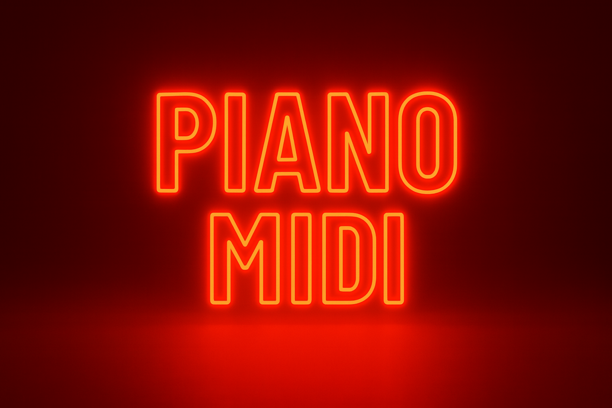

🎹 Piano MIDI Generator — v0.2
After Dark Audio — MIDI Tools Collection

A clean, DAW-ready piano MIDI generator built in Python as part of the After Dark Audio MIDI Tools roadmap. This tool is designed to produce quick, usable musical ideas while demonstrating progression in music-tech engineering, Python design, and structured notebook development. Each version refines clarity, reliability, and creative control as we move toward a full multi-instrument MIDI generator suite.

🚀 Overview
The Piano MIDI Generator creates melodic piano clips in any key and scale using simple pattern logic, safe ranges, and precise timing. It exports files compatible with Ableton, FL Studio, Logic, and all major DAWs, with clean looping and humanization options. Version 0.2 introduces a high-level API, preset scaffolding, batch generation, a structured output system, and tighter MIDI timing — all aligned with the Bass MIDI Generator’s engineering style.

🧱 Features (v0.2)
Core Features (from v0.1)
• Build musical scales from key + scale type
• Generate simple melodic patterns
• Safe piano range (C3–C5)
• Light velocity variation
• Pattern → MIDI conversion via PrettyMIDI
• Timing uses seconds (not ticks) for DAW stability
• Tested for clean, seamless looping

v0.2 Enhancements
• High-level API: generate_piano_midi(...)
• Automatic filename creation
• Global defaults (DEFAULT_KEY, DEFAULT_SCALE, etc.)
• Organized output directory (/content/midi_output/)
• Bar-length clipping and enforcement
• PRESETS scaffolding for future styles
• Humanization helper functions
• Batch-mode generator for multi-clip “albums”
• One-click Colab generator with optional file download
• Notebook-embedded README for GitHub polish

📂 Project Structure (Notebook Cells)
Project Header
Build Checklist
Imports & Setup
Music Settings & Scale Builder
NoteEvent Data Structure
Pattern Generator (v0.1 core)
Pattern → MIDI Converter
Demo Function
v0.2 Development Notes
Global Config & Paths
High-Level API (generate_piano_midi)
Usage Examples
Preset Scaffold
Humanization Helpers
Batch Generator
One-Click UI (Colab)
README (this cell)
Each cell has a single responsibility to maintain clarity and clean engineering flow.

📦 Installation
Local
pip install pretty_midi mido

Google Colab
!pip install -q pretty_midi mido

▶️ Quickstart Usage

1. Generate a default MIDI clip
midi_path = generate_piano_midi()
print(midi_path)

2. Generate a custom clip
clip = generate_piano_midi( key="A", scale_type="minor", num_bars=8, notes_per_bar=4, tempo=128 )
print("Saved:", clip)

3. Save with a custom filename
generate_piano_midi( key="C", scale_type="major", num_bars=4, out_filename="piano_test.mid" )

4. Batch generation (album mode)
paths = batch_generate_presets( key="A", scale_type="minor", num_bars=8, preset_names=["simple_arpeggio", "busy_piano"] )

5. One-Click Colab Generator
Enter key, scale, bars, BPM → receive a MIDI file automatically.

🧠 How It Works

Note Event Format
{ "time": seconds, "duration": seconds, "note": MIDI number, "velocity": 0–127 }

Pattern Logic
• 4 beats per bar
• Timing calculated from tempo + notes per bar
• Slight duration reduction (0.95×) to avoid overlap
• Exact bar length is enforced for perfect looping
• All outputs DAW-tested

API Summary
generate_piano_midi(...) handles: scale building, pattern creation, humanization (optional), bar clipping, MIDI writing — all in a single high-level call.

🔮 Future Upgrades (v0.3+ Roadmap)
• Full preset engine (arps, broken chords, octave jumps)
• Swing & groove options
• Humanization tied dynamically to tempo
• Chord progression builder
• Pattern styles (interval shapes, rhythmic variants)
• Multi-track generation (piano + bass + drums)
• Web or CLI interface
• Ableton-style groove templates
👤 Author
Gabe Chavez
Electronic music producer, DJ, and Python developer building a professional multi-instrument MIDI generation toolkit under After Dark Audio.
